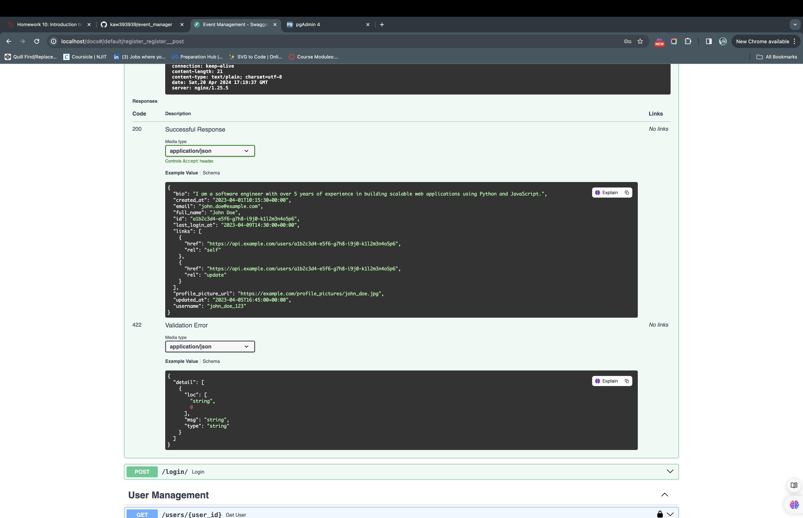
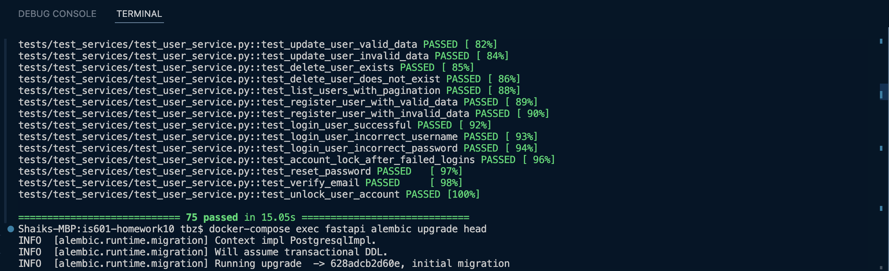
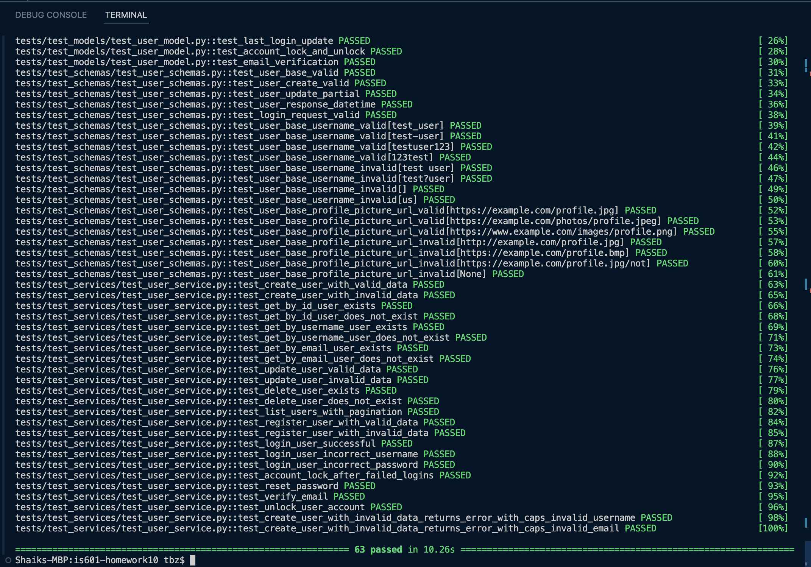
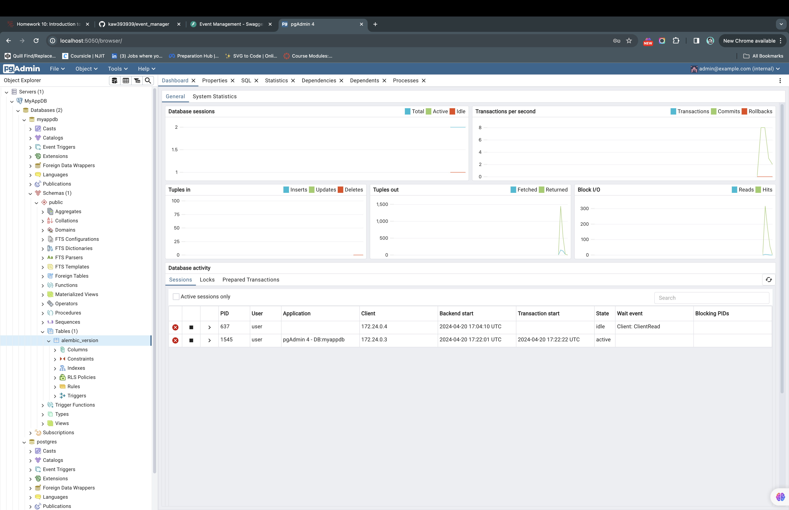

# Shaik Tabrez

## Event Manager Company: Software QA Analyst/Developer Onboarding Assignment
After setting up and following the guide, fastapi is up and running.

## Setup and Preliminary Steps
Make sure the github actions and docker hub tokens are updated accordingly and image build is triggered when needed.
Below is the change that address it: https://github.com/tabrezdn1/is601-homework10/commit/8ca5e62df48cacd2d584f598253bbb2a226d3ce1

Able to create server and perform initial migration

## Testing and Database Management

Testing the application for test cases - all are up and running with no failures.

Database created and accessed via PGAdmin.

## Specific Issues to Address
## All the issues addressed and fixed as per the standards:

1. **Username validation**:
Issue Link: https://github.com/tabrezdn1/is601-homework10/issues/4
PR Link: https://github.com/tabrezdn1/is601-homework10/pull/5

2. **Password validation**:
Issue Link: https://github.com/tabrezdn1/is601-homework10/issues/14
PR Link: https://github.com/tabrezdn1/is601-homework10/pull/15

3. **Profile field edge cases**: 
Issue Link: https://github.com/tabrezdn1/is601-homework10/issues/6
PR Link: https://github.com/tabrezdn1/is601-homework10/pull/7

4. **Issue demonstrated in the instructor video**:
Issue Link: https://github.com/tabrezdn1/is601-homework10/issues/2
PR Link: https://github.com/tabrezdn1/is601-homework10/pull/3

5. **Add normalization to user name**:
Issue Link: https://github.com/tabrezdn1/is601-homework10/issues/8
PR Link: https://github.com/tabrezdn1/is601-homework10/pull/10

6. **Add normalization to email**:
Issue Link: https://github.com/tabrezdn1/is601-homework10/issues/9
PR Link: https://github.com/tabrezdn1/is601-homework10/pull/11

## Submission Requirements

Apart from all the links for issues and PR's mentioned above, find below the other links that are needed:

- Links to the closed issues: https://github.com/tabrezdn1/is601-homework10/issues?q=is%3Aissue+is%3Aclosed
- Link to project image deployed to Dockerhub: https://hub.docker.com/repository/docker/tabrezdn1/fastapi_rest_api/general

## Things I learned and grapsed

- I gained practical experience in software version control by managing a Git repository, effectively using pull requests (PRs) to track changes and ensure code quality before merging into the main branch. I also deepened my understanding of RESTful API integration for seamless communication between services. This process enhanced automated CI/CD pipelines, where successful builds trigger unit tests and subsequently deploy containerized applications to DockerHub, streamlining deployment and scaling in real-world applications.
